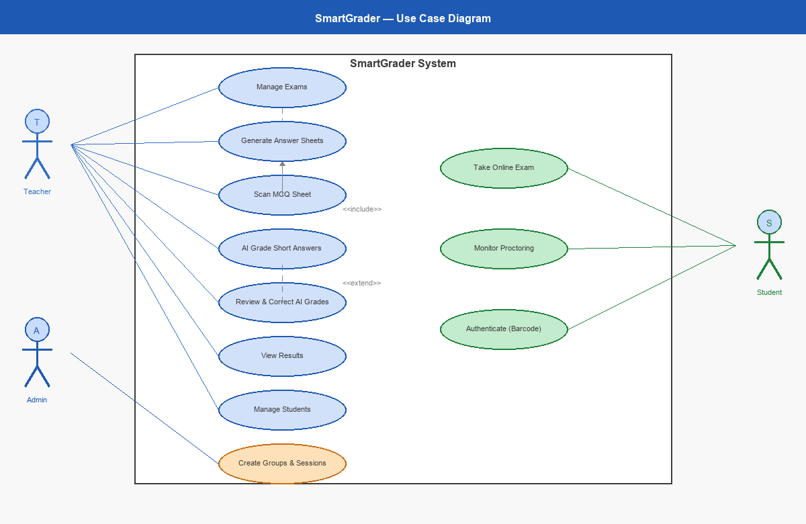
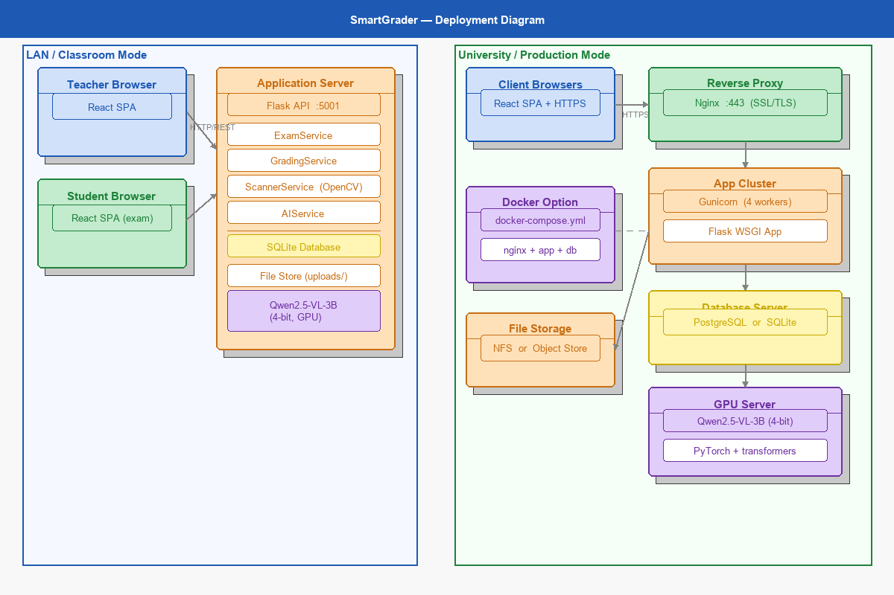
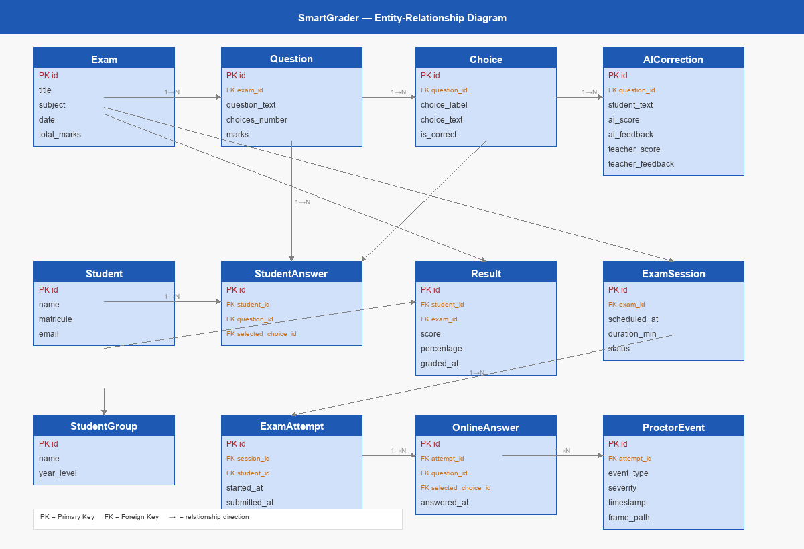
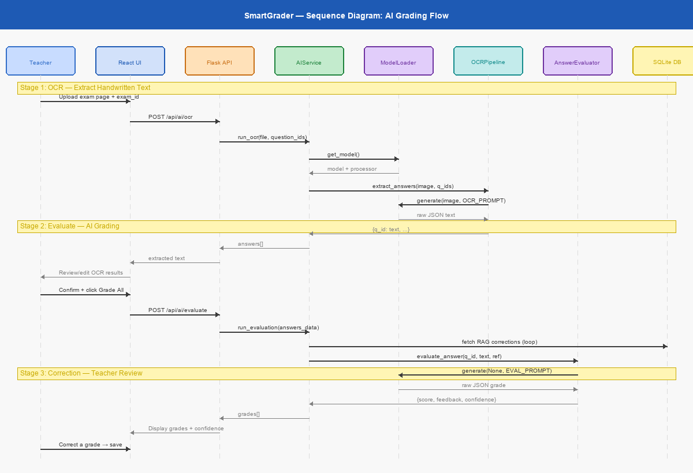
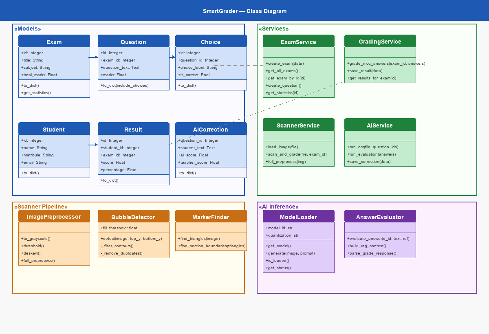
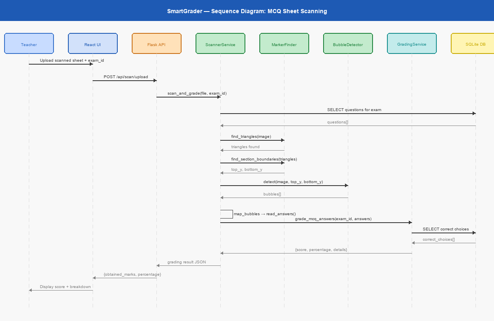

# Chapter 3: Analysis and Design

This chapter presents the requirements analysis and system design for SmartGrader. We begin by defining the functional and non-functional requirements derived from the problem statement in Chapter 1 and the gaps identified in Chapter 2. We then describe the system architecture, database schema, REST API specification, AI grading pipeline, and the UML diagrams that formalise the design.

## 3.1 Functional Requirements

The functional requirements of SmartGrader are organised around the activities of two primary actors: the **Teacher** (the principal user of the system) and the **Student** (whose examination sheets are processed by the system, but who does not interact with the software directly). A third actor, the **System** (comprising the scanner pipeline and AI model), performs automated processing.

### 3.1.1 Use Case Diagram

The use case diagram in Figure 3.1 illustrates the principal interactions between actors and system functions.

*Figure 3.1: Use Case Diagram for SmartGrader*

### 3.1.2 Use Case Descriptions

The following use case descriptions elaborate the principal functional requirements:

**UC-01: Manage Examinations.** The teacher creates a new examination by specifying a title, subject, date, and total marks. The teacher can view the list of all examinations, edit an existing examination's metadata, or delete an examination. Deleting an examination cascades to all associated questions, choices, student answers, and results.

**UC-02: Manage Questions.** For each examination, the teacher defines one or more questions. Each question specifies the question text, the number of answer choices, and the marks allocated to the question. For MCQ questions, the teacher defines the choice labels (A, B, C, D, etc.), choice texts, and designates the correct answer(s).

**UC-03: Generate Answer Sheet.** The system generates a printable A4 answer sheet in PDF format for the examination. The sheet includes OMR alignment markers, a student identification section, and a grid of answer bubbles corresponding to the examination's questions. The layout is computed dynamically based on the number of questions and choices.

**UC-04: Manage Students.** The teacher registers students in the system by providing their name, matriculation number (matricule), and optionally their email address. The matriculation number serves as a unique identifier.

**UC-05: Scan MCQ Answer Sheets.** The teacher uploads a scanned image of a completed answer sheet. The scanner pipeline preprocesses the image (greyscale conversion, adaptive thresholding, morphological cleaning), detects the four corner markers, establishes a coordinate transformation, locates the answer bubbles, determines which bubbles are filled, maps the detected answers to questions, and computes the score by comparison with the correct answers.

**UC-06: AI-Assisted Grading.** The teacher uploads a scanned image of a handwritten answer sheet and selects a question for evaluation. The AI pipeline performs two stages: first, the OCR stage extracts the student's handwritten text using the vision language model; second, the evaluation stage scores the extracted text against the model answer and grading criteria. The teacher can review and optionally correct the AI's output.

**UC-07: Submit Correction.** When the teacher disagrees with the AI-assigned score, they submit a correction specifying the correct score and optional feedback. This correction is stored in the database and used by the RAG mechanism to improve future evaluations of the same question.

**UC-08: View Results.** The teacher views grading results aggregated by examination, including individual student scores, percentages, and grading timestamps.

## 3.2 Non-Functional Requirements

Beyond the functional capabilities described above, SmartGrader must satisfy the following non-functional requirements:

### 3.2.1 Performance

- **MCQ Scanning:** The scanner pipeline shall process a single scanned answer sheet in under 3 seconds on standard hardware.
- **AI Grading:** The AI pipeline shall complete the OCR and evaluation of a single question in under 5 seconds on a GPU with at least 6 GB of VRAM.
- **API Response Time:** All non-AI API endpoints shall respond within 500 milliseconds under normal load.

### 3.2.2 Accuracy

- **Bubble Detection:** The MCQ scanner shall achieve a bubble detection accuracy of at least 95% on answer sheets scanned at 300 DPI or higher.
- **Handwriting OCR:** The VLM-based OCR shall achieve a character-level accuracy of at least 80% on clearly written handwritten text in Arabic, French, and English.
- **AI Grading:** The AI evaluation shall produce scores within one grade point of the teacher's score for at least 70% of evaluated answers, with this percentage expected to improve through RAG corrections.

### 3.2.3 Hardware Requirements

- **Minimum GPU:** NVIDIA GPU with 6 GB VRAM (e.g., GTX 1660, RTX 3060) for 4-bit quantised model inference.
- **Recommended GPU:** NVIDIA GPU with 8 GB VRAM (e.g., RTX 3070, RTX 4060) for improved inference speed.
- **CPU-Only Mode:** The system shall remain functional without a GPU, with AI features gracefully disabled and appropriate user notification.
- **Storage:** At least 10 GB of free disk space for the model weights, database, and uploaded scan images.

### 3.2.4 Security and Data Integrity

- **Input Validation:** All API endpoints shall validate input data types, lengths, and formats before processing.
- **File Upload Security:** Uploaded files shall be validated against an allowlist of permitted extensions (PDF, PNG, JPG, JPEG, TIFF, BMP) and a maximum file size of 50 MB.
- **Foreign Key Integrity:** The database shall enforce referential integrity through foreign key constraints with cascading deletes where appropriate.
- **Local Processing:** All data processing, including AI inference, shall occur locally on the deployment machine. No student data shall be transmitted to external services.

## 3.3 System Architecture

SmartGrader follows a layered architecture that separates concerns across four principal tiers: the presentation layer (frontend), the API layer (Flask routes), the business logic layer (services), and the data access layer (models and database).

### 3.3.1 Deployment Architecture

The deployment diagram in Figure 3.2 illustrates the physical arrangement of system components.

*Figure 3.2: Deployment Diagram*

The system is deployed on a single machine comprising the following components:

- **Web Browser (Client):** The React single-page application runs in the user's browser, communicating with the backend via RESTful HTTP requests. No plugins or extensions are required.
- **Flask Application Server:** The Flask application serves both the REST API and the static frontend assets. It is structured using the application factory pattern, with separate blueprints for examination management, student management, scanning, results, and AI operations.
- **SQLite Database:** The application's persistent state is stored in an SQLite database file (`smart_grader.db`). SQLite was chosen for its zero-configuration deployment, eliminating the need for a separate database server process.
- **GPU / AI Model:** The Qwen2.5-VL-3B-Instruct model is loaded into GPU memory on demand. The model is quantised to 4-bit precision using the BitsAndBytes library, reducing memory requirements from approximately 12 GB (full precision) to 4--6 GB.
- **File System:** Uploaded scan images are stored in the `uploads/` directory on the local file system. Generated PDF answer sheets are produced on demand and served directly to the client.

### 3.3.2 Logical Architecture

The logical architecture follows the Model-Service-Route pattern:

- **Models** (`app/models/`): SQLAlchemy ORM classes that define the database schema and provide data access methods. Each model includes a `to_dict()` method for JSON serialisation.
- **Services** (`app/services/`): Stateless service modules that encapsulate business logic, including examination management, grading computation, scanner pipeline orchestration, and AI model interaction.
- **Routes** (`app/routes/`): Flask blueprint modules that define REST API endpoints, handle request parsing and validation, invoke the appropriate service methods, and format HTTP responses.
- **Scanner** (`app/scanner/`): A dedicated module implementing the computer vision pipeline for MCQ answer sheet processing.
- **AI** (`app/ai/`): A dedicated module managing the vision language model lifecycle, prompt construction, inference execution, and RAG retrieval.

## 3.4 Database Design

The SmartGrader database comprises seven tables that capture the entities and relationships of the examination grading domain. The entity-relationship diagram in Figure 3.3 provides a visual representation of the schema.

*Figure 3.3: Entity-Relationship Diagram*

### 3.4.1 Table: `exams`

The `exams` table stores examination metadata. Each record represents a single examination and contains the following attributes:

| Column | Type | Constraints | Description |
|--------|------|-------------|-------------|
| `id` | INTEGER | PRIMARY KEY, AUTOINCREMENT | Unique examination identifier |
| `title` | TEXT | NOT NULL | Examination title |
| `subject` | TEXT | | Subject or course name |
| `date` | TEXT | | Examination date (ISO format) |
| `total_marks` | REAL | | Maximum achievable score |

### 3.4.2 Table: `questions`

The `questions` table stores the individual questions belonging to each examination.

| Column | Type | Constraints | Description |
|--------|------|-------------|-------------|
| `id` | INTEGER | PRIMARY KEY, AUTOINCREMENT | Unique question identifier |
| `exam_id` | INTEGER | FOREIGN KEY → exams(id), NOT NULL | Parent examination |
| `question_text` | TEXT | NOT NULL | Question text |
| `question_choices_number` | INTEGER | NOT NULL | Number of answer choices (0 for short-answer) |
| `marks` | REAL | NOT NULL | Marks allocated to this question |

A question with `question_choices_number = 0` is treated as a short-answer question eligible for AI grading, while a question with a non-zero value is treated as an MCQ question.

### 3.4.3 Table: `choices`

The `choices` table stores the answer options for MCQ questions.

| Column | Type | Constraints | Description |
|--------|------|-------------|-------------|
| `id` | INTEGER | PRIMARY KEY, AUTOINCREMENT | Unique choice identifier |
| `question_id` | INTEGER | FOREIGN KEY → questions(id), NOT NULL | Parent question |
| `choice_label` | TEXT | NOT NULL | Choice label (A, B, C, D, etc.) |
| `choice_text` | TEXT | NOT NULL | Choice text |
| `is_correct` | INTEGER | DEFAULT 0 | Whether this is the correct answer (1 = correct) |

### 3.4.4 Table: `students`

The `students` table maintains a registry of students whose examinations are processed by the system.

| Column | Type | Constraints | Description |
|--------|------|-------------|-------------|
| `id` | INTEGER | PRIMARY KEY, AUTOINCREMENT | Unique student identifier |
| `name` | TEXT | NOT NULL | Student full name |
| `matricule` | TEXT | UNIQUE, NOT NULL | Student matriculation number |
| `email` | TEXT | | Student email address |

### 3.4.5 Table: `student_answers`

The `student_answers` table records the answer selected by each student for each question, as determined by the MCQ scanner.

| Column | Type | Constraints | Description |
|--------|------|-------------|-------------|
| `id` | INTEGER | PRIMARY KEY, AUTOINCREMENT | Unique answer record identifier |
| `student_id` | INTEGER | FOREIGN KEY → students(id), NOT NULL | Student who answered |
| `question_id` | INTEGER | FOREIGN KEY → questions(id), NOT NULL | Question answered |
| `selected_choice_id` | INTEGER | FOREIGN KEY → choices(id) | Selected answer choice (nullable for unanswered) |

### 3.4.6 Table: `results`

The `results` table stores the aggregated grading outcome for each student-examination pair.

| Column | Type | Constraints | Description |
|--------|------|-------------|-------------|
| `id` | INTEGER | PRIMARY KEY, AUTOINCREMENT | Unique result identifier |
| `student_id` | INTEGER | FOREIGN KEY → students(id), NOT NULL | Student graded |
| `exam_id` | INTEGER | FOREIGN KEY → exams(id), NOT NULL | Examination graded |
| `score` | REAL | NOT NULL | Total score achieved |
| `percentage` | REAL | | Score as percentage of total marks |
| `graded_at` | TEXT | | Timestamp of grading (ISO format) |

### 3.4.7 Table: `ai_corrections`

The `ai_corrections` table implements the RAG feedback loop by storing teacher corrections to AI-generated grades.

| Column | Type | Constraints | Description |
|--------|------|-------------|-------------|
| `id` | INTEGER | PRIMARY KEY, AUTOINCREMENT | Unique correction identifier |
| `question_id` | INTEGER | FOREIGN KEY → questions(id), NOT NULL | Question being corrected |
| `student_text` | TEXT | NOT NULL | OCR-extracted student response text |
| `ai_score` | REAL | NOT NULL | Score originally assigned by the AI model |
| `ai_feedback` | TEXT | | Feedback originally provided by the AI model |
| `teacher_score` | REAL | NOT NULL | Corrected score assigned by the teacher |
| `teacher_feedback` | TEXT | | Teacher's feedback explaining the correction |
| `created_at` | TEXT | NOT NULL | Timestamp of the correction |

When the AI pipeline evaluates a new response, it queries this table for prior corrections on the same question and includes them as few-shot examples in the evaluation prompt. This enables progressive improvement in grading accuracy without model fine-tuning.

### 3.4.8 Indexes

The database defines five indexes to optimise query performance on the most frequently accessed foreign key columns:

- `idx_questions_exam` on `questions(exam_id)`
- `idx_choices_question` on `choices(question_id)`
- `idx_answers_student` on `student_answers(student_id)`
- `idx_answers_question` on `student_answers(question_id)`
- `idx_results_exam` on `results(exam_id)`

## 3.5 API Design

SmartGrader exposes a RESTful API comprising 18 endpoints organised into five resource groups. The following table specifies each endpoint:

### 3.5.1 Examination Endpoints

| Method | Path | Description |
|--------|------|-------------|
| GET | `/api/exams` | Retrieve a list of all examinations |
| POST | `/api/exams` | Create a new examination |
| GET | `/api/exams/<id>` | Retrieve a specific examination by ID |
| PUT | `/api/exams/<id>` | Update an existing examination's metadata |
| DELETE | `/api/exams/<id>` | Delete an examination and all associated data |
| GET | `/api/exams/<id>/questions` | Retrieve all questions for an examination |
| POST | `/api/exams/<id>/questions` | Add a new question to an examination |

### 3.5.2 Student Endpoints

| Method | Path | Description |
|--------|------|-------------|
| GET | `/api/students` | Retrieve a list of all registered students |
| POST | `/api/students` | Register a new student |
| GET | `/api/students/<id>` | Retrieve a specific student by ID |

### 3.5.3 Scanner Endpoint

| Method | Path | Description |
|--------|------|-------------|
| POST | `/api/scan/upload` | Upload a scanned answer sheet for MCQ processing |

The scanner endpoint accepts a multipart form upload containing the scanned image file and the examination ID. It returns the detected answers, computed score, and any processing warnings.

### 3.5.4 Results Endpoints

| Method | Path | Description |
|--------|------|-------------|
| GET | `/api/results/exam/<id>` | Retrieve all results for a specific examination |
| POST | `/api/results` | Manually create or update a grading result |

### 3.5.5 AI and System Endpoints

| Method | Path | Description |
|--------|------|-------------|
| GET | `/api/health` | Health check -- returns system status |
| GET | `/api/ai/status` | Report AI model loading status and GPU availability |
| POST | `/api/ai/ocr` | Perform OCR on a scanned image for a specified question |
| POST | `/api/ai/evaluate` | Evaluate an OCR-extracted answer against the model answer |
| POST | `/api/ai/correct` | Submit a teacher correction for an AI-graded answer |
| GET | `/api/ai/corrections/<id>` | Retrieve all corrections for a specific question |

The AI endpoints follow a sequential workflow: the teacher first calls `/api/ai/ocr` to extract the student's handwritten text, reviews the OCR result, then calls `/api/ai/evaluate` to obtain the AI's score. If the score requires adjustment, the teacher calls `/api/ai/correct` to submit a correction that will improve future evaluations.

## 3.6 AI Pipeline Design

The AI grading pipeline is the most architecturally distinctive component of SmartGrader. It implements a two-stage process -- OCR followed by Evaluation -- augmented by a RAG feedback loop.

### 3.6.1 Pipeline Overview

The sequence diagram in Figure 3.4 illustrates the complete AI grading flow.

*Figure 3.4: Sequence Diagram for AI-Assisted Grading*

The pipeline proceeds through the following stages:

**Stage 1: Optical Character Recognition.** The teacher uploads a scanned image and selects the question to be graded. The system sends the full-page image to the Qwen2.5-VL-3B-Instruct model together with an OCR prompt that identifies the question number and instructs the model to transcribe the student's handwritten response. The model returns the transcribed text, which is presented to the teacher for review.

**Stage 2: Semantic Evaluation.** The transcribed text is submitted to the model a second time, now accompanied by an evaluation prompt that includes the question text, the model answer, optional keywords, and the allocated marks. Before constructing this prompt, the system queries the `ai_corrections` table for any prior teacher corrections on the same question. If corrections exist, they are formatted as few-shot examples and prepended to the prompt, providing the model with concrete illustrations of the teacher's grading expectations.

The model returns a score and a brief textual justification. These are presented to the teacher, who may accept the result or submit a correction.

### 3.6.2 RAG Feedback Loop

The RAG feedback loop operates as follows:

1. The teacher submits a correction via `POST /api/ai/correct`, providing the question ID, the student's transcribed text, the AI's original score and feedback, and the teacher's corrected score and feedback.
2. The correction is persisted in the `ai_corrections` table.
3. On subsequent evaluations of the same question, the system retrieves all corrections for that question, ordered by creation date (most recent first).
4. The retrieved corrections are formatted as few-shot examples within the evaluation prompt, following the pattern: "Student wrote: [text]. The correct score is [score]/[max] because [feedback]."
5. The model, conditioned on these examples, produces scores that are progressively better aligned with the teacher's expectations.

This mechanism provides the benefits of model adaptation without the computational cost and complexity of fine-tuning. It is question-specific, meaning that corrections for one question do not affect the grading of other questions, preserving evaluation independence.

### 3.6.3 Model Configuration

The Qwen2.5-VL-3B-Instruct model is loaded with the following configuration:

- **Quantisation:** 4-bit NormalFloat (NF4) quantisation via BitsAndBytesConfig, with double quantisation enabled for further memory reduction.
- **Compute dtype:** float16 for intermediate computations.
- **Maximum tokens:** 512 tokens for generated responses.
- **Confidence threshold:** 0.7 for answer extraction confidence.
- **Device:** CUDA (GPU) when available; the system falls back gracefully when no GPU is detected.

## 3.7 Class Diagram

The class diagram in Figure 3.5 presents the principal classes and their relationships across the backend application.

*Figure 3.5: Class Diagram*

The class diagram reveals the following structural organisation:

**Model Classes:** `Exam`, `Question`, `Choice`, `Student`, `StudentAnswer`, `Result`, and `AICorrection` correspond directly to the seven database tables. Each model class inherits from `db.Model` (SQLAlchemy's declarative base) and defines its columns as class attributes. Relationships between models are expressed through SQLAlchemy's `relationship()` function, enabling eager or lazy loading of associated records. All model classes implement a `to_dict()` method that returns a dictionary representation suitable for JSON serialisation.

**Service Classes:** `ExamService`, `GradingService`, `ScannerService`, and `AIService` encapsulate the business logic for their respective domains. Services are implemented as modules with stateless functions rather than instantiated classes, reflecting the stateless nature of HTTP request handling. Each service function accepts the necessary parameters (typically model instances or identifiers) and returns results without maintaining internal state between calls.

**Route Blueprints:** `exam_routes`, `student_routes`, `scan_routes`, `result_routes`, and `ai_routes` are Flask blueprint modules that map HTTP endpoints to handler functions. Each handler parses the incoming request, delegates to the appropriate service function, and constructs the HTTP response.

**Scanner Module:** The scanner module contains specialised classes for image preprocessing, marker detection, bubble detection, grid mapping, and answer reading. These are orchestrated by a top-level `process_scan()` function that implements the complete scanning pipeline.

**AI Module:** The AI module manages model loading (with lazy initialisation to avoid unnecessary GPU memory allocation), prompt template construction, inference execution via the Hugging Face `transformers` library, and RAG retrieval from the corrections database.

## 3.8 Sequence Diagrams

Two sequence diagrams illustrate the principal processing flows of the system.

### 3.8.1 MCQ Scanning Sequence

The MCQ scanning sequence diagram in Figure 3.6 depicts the flow initiated when a teacher uploads a scanned answer sheet for automated MCQ grading.

*Figure 3.6: Sequence Diagram for MCQ Scanning*

The sequence proceeds as follows:

1. **Upload:** The teacher submits a scanned image via the web interface, which sends a `POST /api/scan/upload` request to the backend.
2. **Preprocessing:** The scanner service converts the image to greyscale, applies adaptive thresholding to produce a binary image, and performs morphological opening and closing to reduce noise.
3. **Marker Detection:** The service locates the four corner markers (large filled squares) printed on the answer sheet. These markers define the coordinate system and enable correction for scan skew and scaling.
4. **Perspective Correction:** Using the four marker centres, the service computes a perspective transformation matrix and warps the image to produce an orthogonally aligned, consistently scaled working image.
5. **Bubble Detection:** The Circular Hough Transform (or contour-based detection as a fallback) identifies all candidate bubbles in the corrected image. Candidates are filtered by area, circularity, and aspect ratio using the thresholds defined in the configuration.
6. **Grid Mapping:** Detected bubbles are assigned to a logical grid of questions and choices based on their spatial coordinates relative to the marker positions. The grid structure is determined by the examination's question and choice counts.
7. **Fill Detection:** For each bubble, the mean pixel intensity within its boundary is computed. Bubbles with a mean intensity below the fill threshold (configured at 50) are classified as filled.
8. **Answer Comparison:** The detected student answers are compared against the correct answers stored in the database. The score is computed as the sum of marks for correctly answered questions.
9. **Response:** The results (detected answers, score, percentage, and any warnings) are returned to the frontend and displayed to the teacher.

### 3.8.2 AI Grading Sequence

The AI grading sequence, depicted in Figure 3.4, follows the two-stage pipeline described in Section 3.6. The key interactions are:

1. The teacher selects an uploaded scan and a question for AI grading.
2. The frontend sends a `POST /api/ai/ocr` request with the image and question identifier.
3. The AI service loads the model (if not already loaded), constructs the OCR prompt, and invokes the model.
4. The transcribed text is returned to the frontend, where the teacher reviews it for accuracy.
5. The teacher requests evaluation, triggering a `POST /api/ai/evaluate` request with the transcribed text and question details.
6. The AI service queries the `ai_corrections` table for prior corrections, constructs the evaluation prompt (with RAG examples if available), and invokes the model.
7. The score and feedback are returned to the frontend.
8. If the teacher disagrees with the score, they submit a correction via `POST /api/ai/correct`, which is stored for future RAG retrieval.

This two-stage design (OCR then Evaluate) provides the teacher with a checkpoint between transcription and scoring, allowing them to correct OCR errors before they propagate to the evaluation stage. This separation also enables the system to be used for OCR-only tasks when grading is not required.
